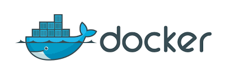
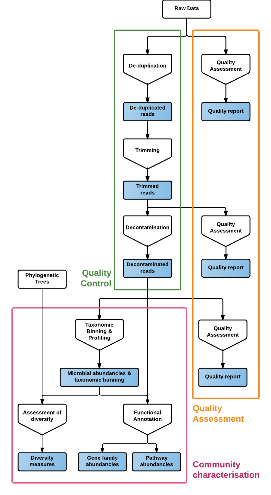
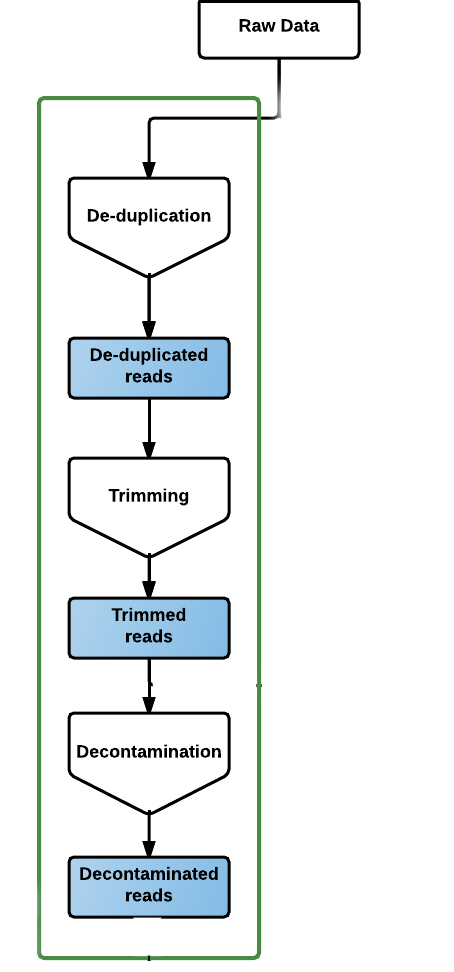
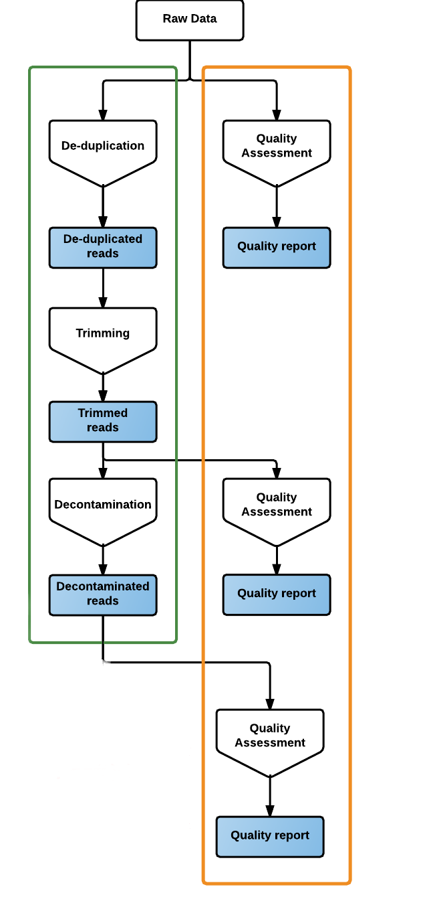
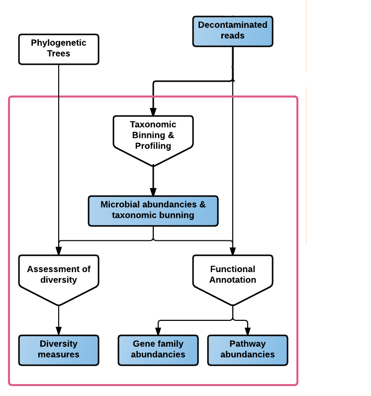

<!-- Slide powered by MARP (https://github.com/yhatt/marp) -->

<!-- $theme: gaia -->

# YAMP: Yet Another Metagenomic Pipeline

##### <u>Alessia Visconti</u>, Tiphaine Martine, Mario Falchi
###### TwinsUK, King's College London

---

<!-- *template: invert -->

# Why?

---

# 1. Easy to use

---

# 2. Portable

---

# 3. Flexible

---

# 4. Reproducible

---

<!-- *template: invert -->

# How?

---

* Highly parallel
* Easily portable
* Very flexible and customisable

---

 

* Lightweight, self-contained systems
* Software version management

---

<!-- *template: invert -->

# What?

---

---

#### Quality Control I

 

* De-duplication: `clumpify`
* Trimming: `BBduk`
* Decontamination: `BBwrap`

---

#### Quality Control II

 

* Assessment: `FastQC`

---

#### Community Characterisation

* Taxonomy binning & profiling: `metaphlan2`
* Functional annotation: `HUMAnN2`
* Assessment of diversity: `QIIME`

---

<!-- *template: invert -->

# Where?

---

 

    
<a>https://github.com/alesssia/YAMP</a>
<a>https://github.com/alesssia/YAMP/wiki</a>
         
    
<a>https://hub.docker.com/r/alesssia/yampdocker</a>

---

<!-- *template: invert -->

# Who?

---

### Acknowledgements

	TwinsUK

Mario Falchi
Tiphaine Martin

	The "community"

 Brian Bushnell
 Paolo Di Tommaso

  

<a> @_alesssia</a> 
<a> alessia.visconti@kcl.ac.uk</a>

