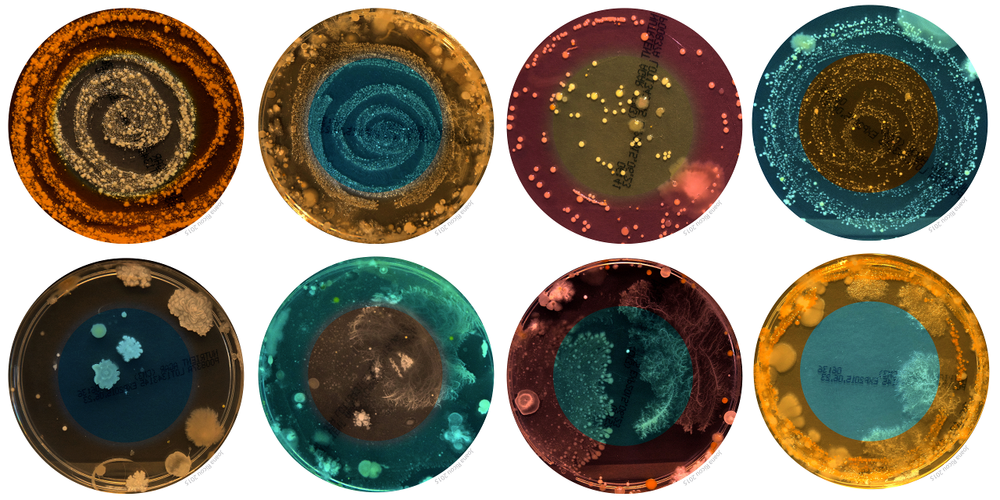

<!-- $theme: gaia -->

###### &nbsp;
## Reproducible shotgun metagenomic analysis with Nextflow and containers

###### &nbsp;

#### Alessia Visconti
###### TwinsUK, King's College London

##### <a> @_alesssia</a> 

---
<!-- *template: invert -->

# Metagenomics?!?

---

<centre>

</centre>

*[Belly Button Microbiome &copy; Joana Ricou](http://microbialart.tumblr.com/)*

---

> Metagenomics is the study of genetic material recovered directly from environmental samples.
*[Metagenomics - Wikipedia](https://en.wikipedia.org/wiki/Metagenomics)*

---
<!-- *template: invert -->

# Metagenomics @TwinsUK

---

<centre>

</centre>

---

<centre>

</centre>

---

---
<!-- *template: invert -->

# With great power comes great responsibility 
# (and great trouble)

---

# 1. Reproducible 

---

# 2. Portable 

---

# 3. Flexible 

---

# 4. Efficient

---

# 5. Easy to use 

---
<!-- *template: invert -->

# Reinventing the wheel?

---
#### Well-structured workflows

---
<!-- *template: invert -->

# Are we there yet?

---
#### Same data & pipeline, different OS and results

Kallisto and Sleuth pipelines, applied to find differentially expressed genes (q-value < 0.01) in an RNA-seq experiment, using data from human lung fibroblasts. 

[Di Tommaso et. al, Nat. Biotechnol	(2017)](https://www.nature.com/articles/nbt.3820#f1)

--- 
## Containers

 

---
#### Same data, pipeline, container, and results

Kallisto and Sleuth pipelines, applied to find differentially expressed genes (q-value < 0.01) in an RNA-seq experiment, using data from human lung fibroblasts.

[Di Tommaso et. al, Nat. Biotechnol	(2017)](https://www.nature.com/articles/nbt.3820#f1)

---
<!-- *template: invert -->

# YAMP: *Yet Another Metagenomics Pipeline*

---
# 1. Reproducible 

* Parameters all in the same place 
	
		qin=33
		kcontaminants = 23
		phred = 10 trimmed 
		minlength = 60 
   		mink = 11 
		hdist = 1   
		...
	
* Container Integration 

		nextflow run <script> -with-docker <docker>
        nextflow run <script> -with-singularity <docker>
        
* Detailed logs
   

---
# 2. Portable 

* Cluster1

		executor 'sge'

* Cluster2

		executor 'pbs'

* Personal laptop

		// executor 'sge'

* The *Cloud* 

		
---
# 3. Flexible 

	process dedup {
	
		input:
		set file(in1), file(in2) from todedup

		output:
		file("${params.prefix}_dedupe*.fq") into totrim
		file("${params.prefix}_dedupe*.fq") into topublishdedupe

		when:
		(params.mode == "QC" || params.mode == "complete") && params.dedup
        
            script:
	        """
                ...
        
            """
    }

---
# 4. Efficient

* User-transparent parallelisation
		
* Resources fully exploited 

	

	    $trim 
	    {
	        time '1h'
	        cpus 4
	        memory '32 GB'	  
	    }

	    $qualityAssessmentTrimmed
	    {
	        time '15m'
	        cpus 4
	        memory '4 GB'
	    }
		
	

---
# 5. Easy to use 

Install YAMP (with preset default parameters)
    
	git clone https://github.com/alesssia/YAMP.git
 
Download the supporting data
  
	wget https://zenodo.org/record/1068229/files/YAMP_resources_20171128.tar.gz
	tar -xzf YAMP_resources_20171128.tar.gz
    
Run the analysis
 
	nextflow run YAMP.nf --reads1 R1.fq.gz --reads2 R2.fq.gz
		--prefix mysample --outdir outdir --mode complete
	        --with-singularity docker://alessia/yampdocker

---

# 6. Not only for reproducibility

---

  
# 7. Not only for metagenomics

   &nbsp;
<a>https://nf-co.re</a>

</centre>

---
<!-- *template: invert -->

# Nextflow + containers = :tada:

---

 

   
<a>https://github.com/alesssia/YAMP</a>

 

 
<a>https://hub.docker.com/r/alesssia/yampdocker</a>

 

---
### <u>Acknowledgements </u>

Mario Falchi
Tiphaine Martin

Paolo Di Tommaso
Richard Davies

 

<a> @_alesssia</a> 
<a> alessia.visconti@kcl.ac.uk</a>

