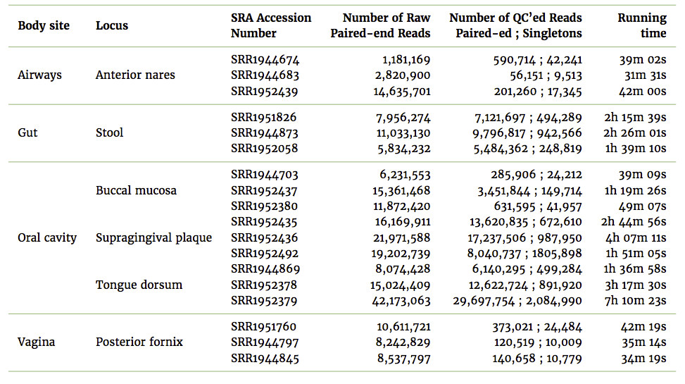

<!-- $theme: gaia -->

## YAMP: a framework enabling reproducibility in metagenomics research

#####  Alessia Visconti
###### <a> @_alesssia</a> 

---
<!-- *template: invert -->

# Reproducibility

---

# >50%           >70%

###  &nbsp;&nbsp;&nbsp;&nbsp; Repeatability  Reproducibility

[Baker, Nature	(2016)](https://www.nature.com/news/1-500-scientists-lift-the-lid-on-reproducibility-1.19970)

---

[Baker, Nature	(2016)](https://www.nature.com/news/1-500-scientists-lift-the-lid-on-reproducibility-1.19970)

---

[Baker, Nature	(2016)](https://www.nature.com/news/1-500-scientists-lift-the-lid-on-reproducibility-1.19970)

---

# ~31%

## not-reproducible &rarr; non-trustable

[Baker, Nature	(2016)](https://www.nature.com/news/1-500-scientists-lift-the-lid-on-reproducibility-1.19970)

---

---
<!-- *template: invert -->

# What cause irreproducible research?

---

# 1. Unavailability of primary data

---

# Solution: data repository

[Data Sharing - Wikipedia](https://en.wikipedia.org/wiki/Data_sharing)

---

# 2. Unavailability of sufficient details on computational experimentation 

---

---

# Provenance

---

### Solution: well-structured workflows

---

---

---

---

---
<!-- *template: invert -->

# Data Sharing + 
# well-structured workflow

---

# 3. Variations across workstations and operating systems

---

#### Same data & pipeline, different OS and results

Kallisto and Sleuth pipelines, applied to find differentially expressed genes (q-value < 0.01) in an RNA-seq experiment, using data from human lung fibroblasts. 

[Di Tommaso et. al, Nat. Biotechnol	(2017)](https://www.nature.com/articles/nbt.3820#f1)

--- 

# Solution: containers

[What is a container - Docker](https://www.docker.com/what-container)

---
<!-- *template: invert -->

# Data sharing +
# well-structured containerised workflow

---

#### Same data, pipeline, container, and results

Kallisto and Sleuth pipelines, applied to find differentially expressed genes (q-value < 0.01) in an RNA-seq experiment, using data from human lung fibroblasts.

[Di Tommaso et. al, Nat. Biotechnol	(2017)](https://www.nature.com/articles/nbt.3820#f1)

---
<!-- *template: invert -->

# Metagenomics

---

 

<centre>

</centre>

[Belly Button Microbiome &copy; Joana Ricou](http://microbialart.tumblr.com/)

---

> Metagenomics is the study of genetic material recovered directly from environmental samples.
*[Metagenomics - Wikipedia](https://en.wikipedia.org/wiki/Metagenomics)*

---

 

---
<!-- *template: invert -->

# How to conduct metagenomics studies (simplified)

---

---
<!-- *template: invert -->

# YAMP: *Yet Another Metagenomics Pipeline*

---
<!-- *template: invert -->

## Why?

---

# 1. Easy to use 

---

# 2. Portable 

---

# 3. Flexible 

---

# 4. Reproducible 

---
<!-- *template: invert -->

# How?

---

---
<!-- *template: invert -->

# What?

---

---

---

---

Additional output: detailed log file & statistics of memory usage and time of execution

---
<!-- *template: invert -->

# A case study

---

 

  

HMP Phase III, [PRJNA275349](http://www.ebi.ac.uk/ena/data/view/PRJNA275349)

---

2.60GHz Intel&reg; Xeon&reg; processor with 32 GB of RAM

---

Phylum level relative abundances

---

PCoA evaluated on the Bray-Curtis dissimilarity among species relative abundances

---
<!-- *template: invert -->

# Conclusion

---

# 1. Easy to use

---

Install YAMP (with preset default parameters):
	
    
	git clone https://github.com/alesssia/YAMP.git
   

Download the supporting data:
  
  	wget https://zenodo.org/record/1068229/files/YAMP_resources_20171128.tar.gz
    tar -xzf YAMP_resources_20171128.tar.gz
    

 
 Run your analysis:
 
    nextflow run YAMP.nf --reads1 R1.fq.gz --reads2 R2.fq.gz
    	--prefix mysample --outdir outdir --mode complete
            --with-singularity docker://alessia/yampdocker

---

# 2. Portable 

---

* SGE cluster

	executor = 'sge'

* PBS/Torque cluster

	executor = 'pbs'
	

* Your laptop

	// executor = 'sge'

---

# 3. Flexible

---

# 4. Reproducible 

---

# 5. Not only for metagenomics

---

# 6. Not only for reproducibility

---
<!-- *template: invert -->

# Where?

---

    
<a>https://github.com/alesssia/YAMP</a>
<a>https://github.com/alesssia/YAMP/wiki</a>

 

 
<a>https://hub.docker.com/r/alesssia/yampdocker</a>

 
 
 
<a>https://www.biorxiv.org/content/early/2017/11/21/223016</a>

---
<!-- *template: invert -->

# Who?

---
### <u>Acknowledgements </u>

Mario Falchi
Tiphaine Martin

Paolo Di Tommaso
Brian Bushnell 

Richard Davies

 

  

<a> @_alesssia</a> 
<a> alessia.visconti@kcl.ac.uk</a>

