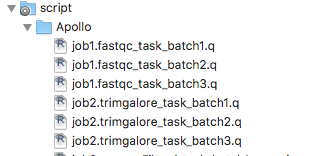

<!-- $theme: gaia -->

# Simplifying shotgun metagenomics analysis with Nextflow
#### <u>Alessia Visconti</u>
###### *TwinsUK*, King's College London

---
<!-- *template: invert -->

# Metagenomics?!?

---

 

<centre>

</centre>

*[Belly Button Microbiome &copy; Joana Ricou](http://microbialart.tumblr.com/)*

---

> Metagenomics is the study of genetic material recovered directly from environmental samples.
*[Metagenomics - Wikipedia](https://en.wikipedia.org/wiki/Metagenomics)*

---

 

---
<!-- *template: invert -->

# Metagenomics @TwinsUK

---

# Pilot study 

 

<centre>

</centre>

---

# Let's go big!

 
  
* 1300 samples 
* 22M reads per sample 
* 1.6 Gb of data per sample 
* Novel in-house analysis workflow

---

  

---
<!-- *template: invert -->

# Why has this happened?

---

---

# The analysis *'workflow'*

---

# The infrastructure

  

* Cluster1: `SGE`
* Cluster2: `PBS`
* Cluster3: `Slurm`

---

# A recipe for disaster

  

* Limited computational literacy
* Fast-moving field 
* Big(ger) data 

---
<!-- *template: invert -->

# Rewind

---

#### MAP, Metagenomics Analysis Pipeline

 

 <a>https://github.com/alesssia/MAP</a> 

   

--- 

## This is not a solution

<small> &nbsp; </small>

* No step parallelisation 
* Limited portability 
* Resources not fully exploited
* Software management still problematic

---
<!-- *template: invert -->

# Rewind (again)

---

  

---
<!-- *template: invert -->

# Is this the solution?

---

## Parallelisation

<small> &nbsp; </small>

	process decontaminate {

	...
    
	output:
	file "${params.prefix}_clean.fq" into assessdecontaminated
	file "${params.prefix}_clean.fq" into toprofiletaxa
	file "${params.prefix}_clean.fq" into toprofilefunction
	
 

 <u>Disclaimer:</u> I know I could use the 'into' operator to duplicate the channel output 

---

## Portability

* Cluster1

	executor = 'sge'

* Cluster2

	executor = 'pbs'
	queue = 'metagenome'

* My laptop

	// executor = 'sge'

---

## Resources fully exploited 

    $trim 
    {
        time =  '1h'
        cpus = 4
        memory = '32 GB'
        jobName = "trim"	  
    }

    $qualityAssessmentTrimmed
    {
        time =  '15m'
        cpus = 4
        memory = '4 GB'
        jobName = "qualityAssessmentTrimmed"
    }
		

---

## Reproducibility

* All parameters in one place 

	
	qin=33
	kcontaminants = 23
	phred = 10 trimmed 
	minlength = 60 
    mink = 11 
	hdist = 1   

	...
	

* Docker Integration 

	nextflow run <script> -with-docker <docker>
   

---

## Flexibility

 A single parameter in the configuration file

	dedup = true

 and a test in the main script 

    process dedup {
	
	...

	when:
	  params.dedup

 allow selecting whether dedup should be performed 

---

## A few more extra

* File management

	publishDir wdir, mode: 'copy', pattern: "*.{html,txt}"

* Profiling 

---

# A recipe for success

 

* Simplicity
* Flexibility
* Portability
* Reproducibility

---
<!-- *template: invert -->

# All's well that ends well

---

#### YAMP, Yet Another Metagenomics Pipeline

    
<a>https://github.com/alesssia/YAMP</a>
<a>https://github.com/alesssia/YAMP/wiki</a>
         
    
<a>https://hub.docker.com/r/alesssia/yampdocker</a>

 

---
### <u>Acknowledgements </u>

Mario Falchi
Tiphaine Martin

Paolo Di Tommaso

    

  

<a> @_alesssia</a> 
<a> alessia.visconti@kcl.ac.uk</a>

