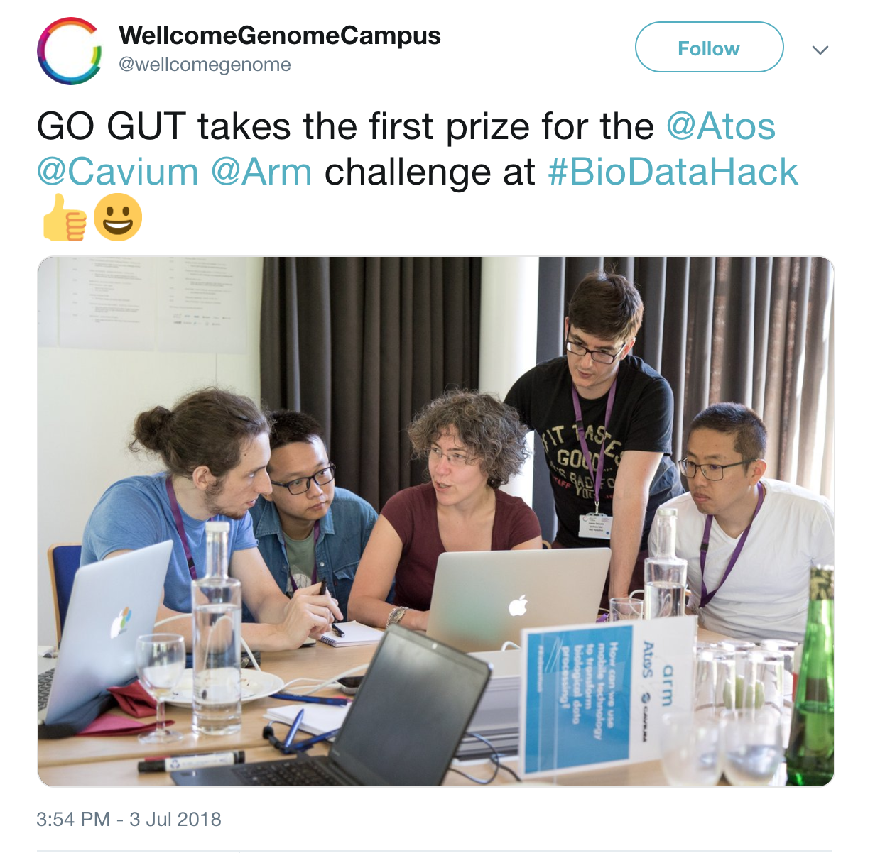
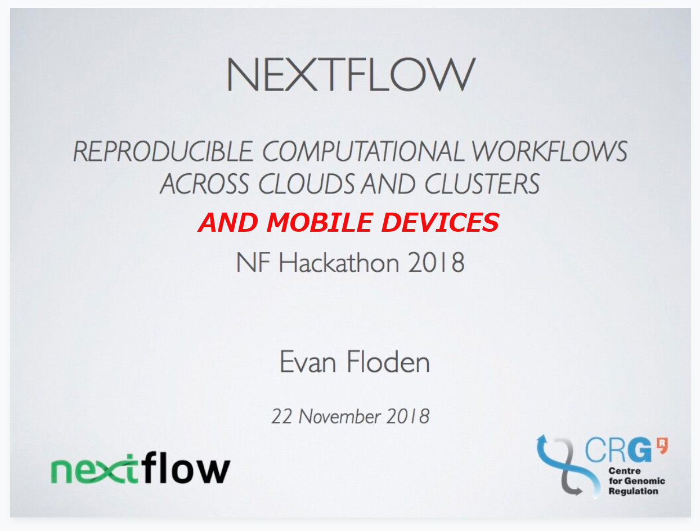

<!-- Slide powered by MARP (https://github.com/yhatt/marp) -->

<!-- $theme: gaia -->

###### &nbsp;
# Nextflow on the go

###### &nbsp;

### Alessia Visconti
###### Research Fellow, King's College London
###### &nbsp;
##### <a> @_alesssia</a> 

---
<!-- *template: invert -->

# Rewinding...

---

### Nextflow Hackathon 2017

<centre>
 
</centre>

---

## YAMP

> A workflow that enables the analysis of whole shotgun metagenomic data while using containerization to ensure computational reproducibility and facilitate collaborative research. 
 

[Visconti *et al*, GigaScience, 2018](https://academic.oup.com/gigascience/article/7/7/giy072/5039705)

---

## Reproducibility  :heart_eyes:

<centre>

</centre>

---

## YAMP

>Being based on Nextflow, YAMP can be executed on any UNIX-like system and offers seamless support for multiple job schedulers as well as for the Amazon AWS cloud.

[Visconti *et al*, GigaScience, 2018](https://academic.oup.com/gigascience/article/7/7/giy072/5039705)

---

## Portability  :heart_eyes:

<centre>
 
</centre>

---

## Anywhere else?

<centre>
 
</centre>

---

<centre>
 
</centre>

---

### Time for testing :fearful:

<centre>
 
</centre>

**ARM Cavium&reg; ThunderX2**

---

## Test passed :sweat_smile:

<centre>
 
</centre>

---
<!-- *template: invert -->

# How? 

---

## Nextflow

<centre>
 
</centre>

---
<!-- *template: invert -->

# Problem: no containerization :scream:

---

## Dependencies

* BBmap
* QIIME
* MetaPhlAn2 (Bowtie2)
* HUMANn2

---

## Bowtie2 :sob:

<centre>
 
</centre>

---

## QIIME :persevere:

<centre>
 
</centre>

---
<!-- *template: invert -->

## Concluding...

---

## Take-home message #1

<centre>
 
</centre>

---

## Take-home message #2

<centre>
 
</centre>

---

### <u>Acknowledgements </u>

 

**GoGut Team**

Jun Aruga - Oliver Giles - Ioannis Valasakis - Chen Zhang  

 

**CRG**
Paolo di Tommaso - All the organisers

  

<a> @_alesssia</a> 
<a> alessia.visconti@kcl.ac.uk</a>

---
<!-- *template: invert -->

# Questions?

