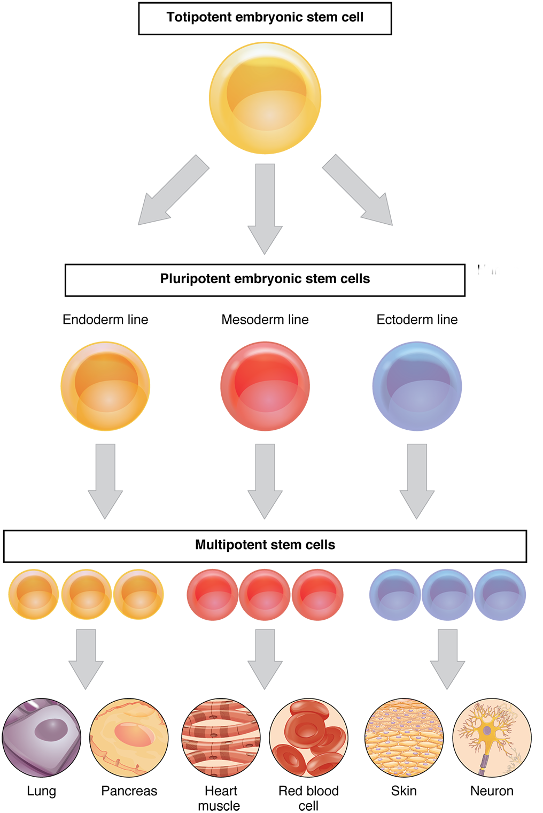
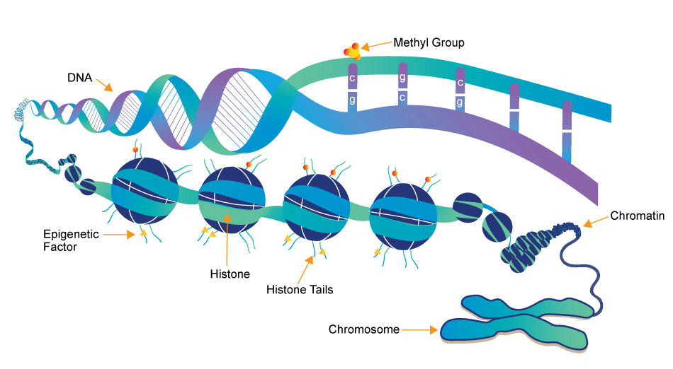
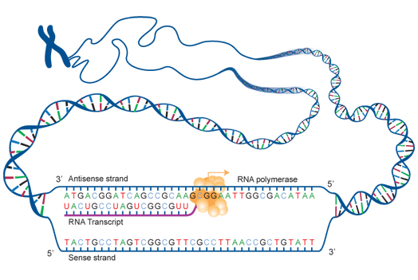
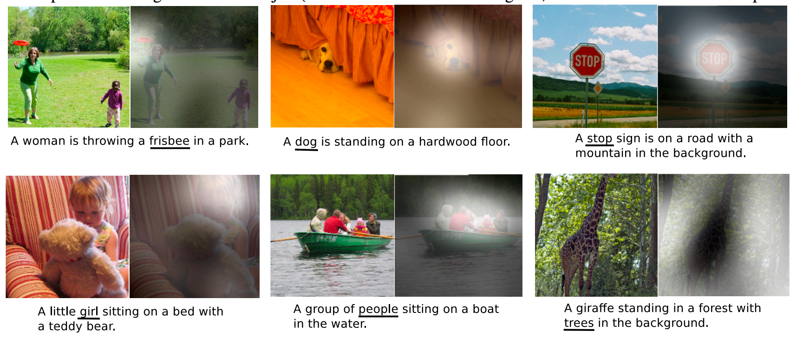
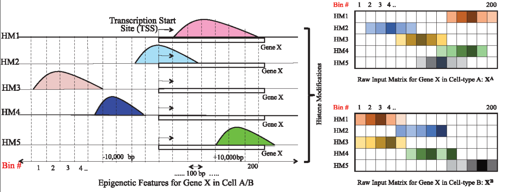
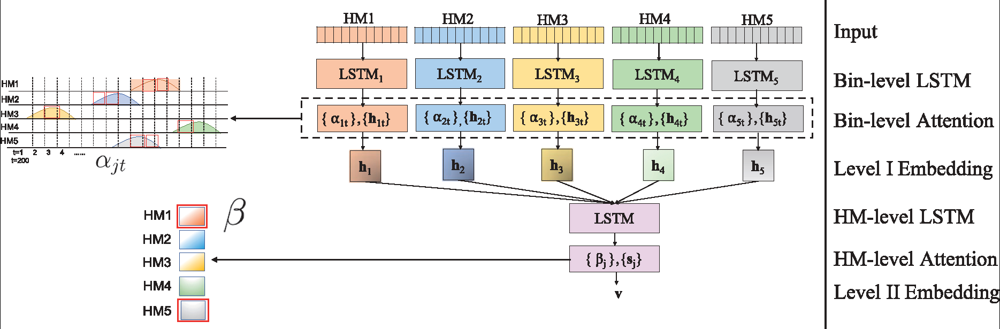
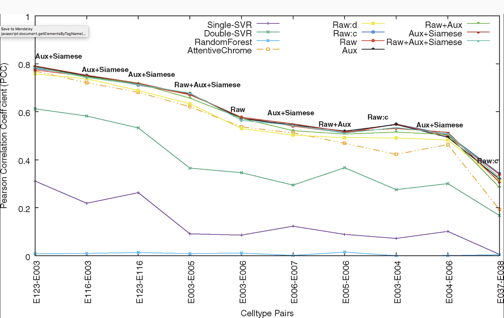
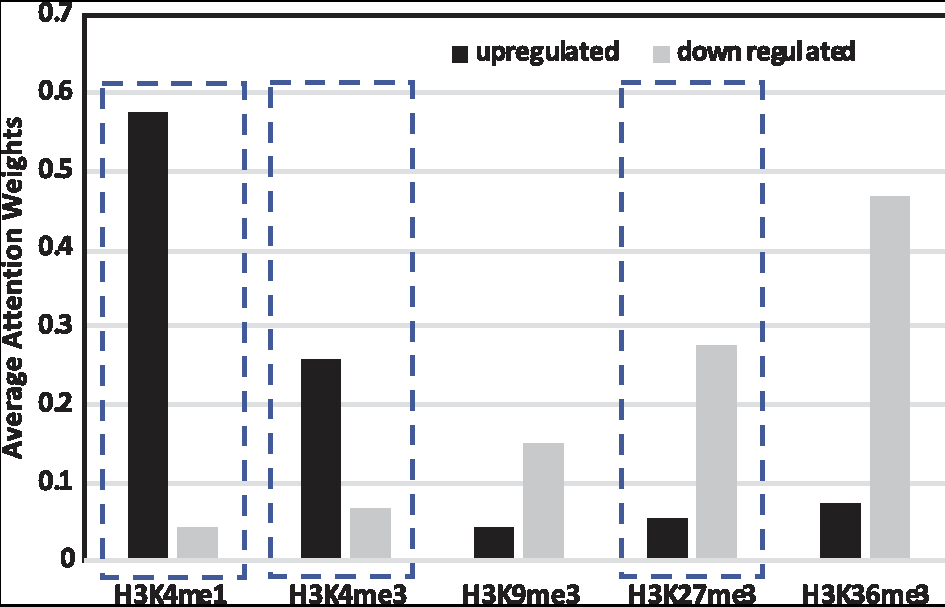

<!-- Slide powered by MARP (https://github.com/yhatt/marp) -->

<!-- $theme: gaia -->

#### DeepDiff: DEEP-learning for predicting DIFFerential gene expression from histone modifications
###### &nbsp;
###### *A. Sekhon, R. Singh, and  Y. Qi,  Bioinformatics 34 (17)*

###### &nbsp;
###### &nbsp;
###### UnConference 2018 

###### *[@_alesssia](https://twitter.com/_alesssia)* - *[@AIClubGenderMinority](https://twitter.com/AIClubGenderMin)* - *[@H2Oai](https://twitter.com/h2oai)*

---
<!-- *template: invert -->

# What? Why?

---

<centre>
  
</centre>

---

<centre>

</centre>

---

<centre>

</centre>

---

## Differential gene expression: cell differentiation and <u>diseases</u>

---
<!-- *template: invert -->

# Challenges

---

#### 1. Genome-wide histone modification (HM) signals are spatially structured and may have long-range dependency

---

#### 2. We want to  understand what the relevant HM factors are, and how they work together 

---

#### 3. We want to understand how HMs affect gene regulation, therefore we require a model with a degree of interpretability 

---

#### 4. We are dealing with multiple cells 

---
<!-- *template: invert -->

# How?

---
### Recurrent Neural Networks (RNNs)

<centre>

</centre>

[Understanding LSTM Networks](https://colah.github.io/posts/2015-08-Understanding-LSTMs/)

---
### Recurrent Neural Networks (RNNs)

<centre>

</centre>

[Understanding LSTM Networks](https://colah.github.io/posts/2015-08-Understanding-LSTMs/)

---
#### Long Short Term Memory networks (LSTMs)

<centre>

</centre>

[Understanding LSTM Networks](https://colah.github.io/posts/2015-08-Understanding-LSTMs/)

---
#### Attention-based deep-learning methods

<centre>

</centre>

[How to Automatically Generate Textual Descriptions for Photographs with Deep Learning](https://machinelearningmastery.com/how-to-caption-photos-with-deep-learning/)

---
<!-- *template: invert -->

# DeepDiff

---
## Input generation

<centre>
 
</centre>

----
## DeepDiff network architecture

<centre>
 
</centre>

---
###  Multitasking with auxiliary tasks

1. Cell-type specific  prediction
2. Siamese architecture formulation

---
<!-- *template: invert -->

# Results

---
## Dataset

* 10 cell lines from the RoadMap project  (18,460 genes)

	* 10,000 genes used for training
	* 2,360 genes used for validation (and tuning)
	* 1,100 genes used for testing

* Performances as PCC between DeepDiff variants and *baselines* (aka, alternative approaches)

---
## Performances

<centre>

</centre>

---
## Interpretation via Attention

<centre>

</centre>

---
<!-- *template: invert -->

# Discussion

---

### Points for discussion

1. Any thoughts on DeepDiff architecture?
2. Will the DeepDiff generalise with new cell lines?
3. Is this the best way to evaluate DeepDiff?
4. Is attention helpful?

---

<!-- *template: invert -->

# Thanks for surviving until the end of the last session :sunglasses:
# You deserve :pizza:

<centre>
  
</centre>

  #H2OAIWorld London &nbsp;&nbsp;&nbsp;&nbsp;

